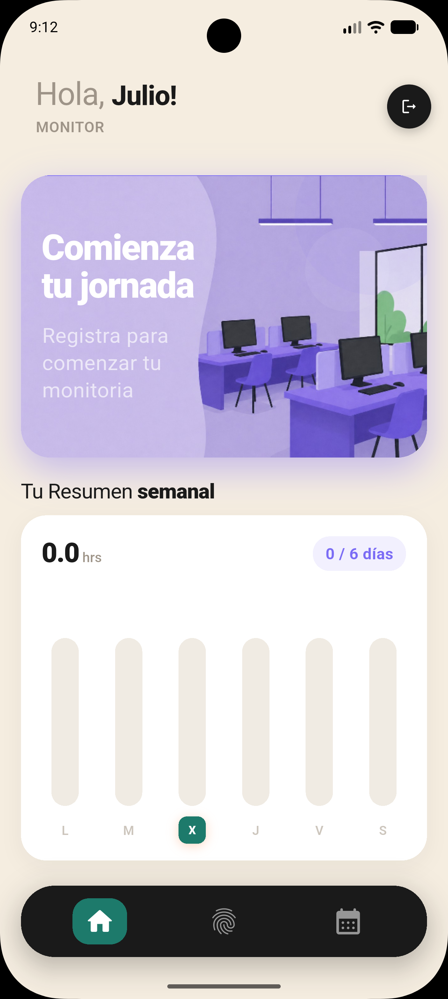
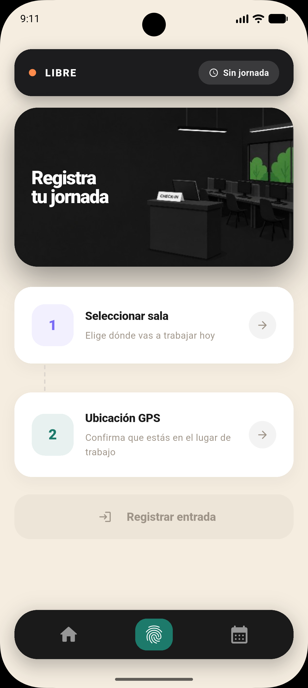
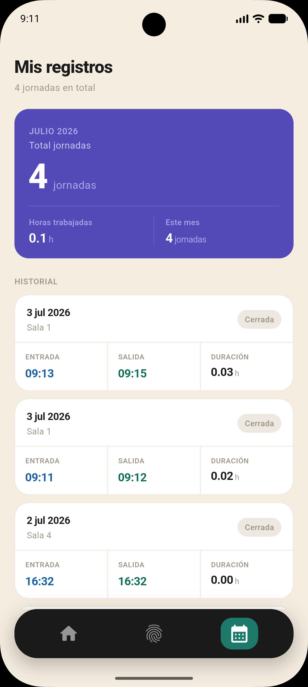

# SIGEM — App de Monitorías

**SIGEM** (Sistema de Gestión de Monitores) es la aplicación cliente en **Flutter** para el control de asistencia de monitores universitarios: check-in/check-out con validación de geolocalización, evidencia fotográfica, historial de horas y un panel de administración para gestionar monitores y generar reportes.

Este repositorio corresponde al **frontend multiplataforma** (Android, iOS, Web, Windows, macOS y Linux) que consume la API [`SIGEM_backend`](https://github.com/N4him/SIGEM_backend), desarrollada para la Escuela de Ingeniería de Sistemas y Computación de la Universidad del Valle.


## Capturas de pantalla

<!--
Reemplaza cada ruta por tus propias imágenes (colócalas, por ejemplo, en una carpeta `docs/screenshots/` dentro del repo).
Tamaño recomendado: 300-400px de ancho para que se vean bien en una fila de 3-4 columnas.
-->

<p align="center">
  
  
  
</p>

> 🎥 [Ver demo en video/GIF](docs/screenshots/demo.gif) — flujo completo de check-in con validación de ubicación.

---

## Tabla de contenido

- [Características](#características)
- [Arquitectura](#arquitectura)
- [Stack tecnológico](#stack-tecnológico)
- [Estructura del proyecto](#estructura-del-proyecto)
- [Puesta en marcha](#puesta-en-marcha)
- [Configuración de la API](#configuración-de-la-api)
- [Flujo de autenticación](#flujo-de-autenticación)
- [Permisos del dispositivo](#permisos-del-dispositivo)
- [Plataformas soportadas](#plataformas-soportadas)
- [Backend relacionado](#backend-relacionado)

---

## Características

- 🔐 **Autenticación JWT** con registro, login, refresh automático de tokens y almacenamiento seguro (`flutter_secure_storage`).
- 📍 **Check-in / check-out geolocalizado**: captura la ubicación GPS del dispositivo (`geolocator`) y la envía al backend para validar que el monitor esté dentro del radio permitido de la sala.
- 📸 **Captura de foto de salida** con la cámara o galería (`image_picker`) como evidencia de la jornada.
- 🗓️ **Historial de asistencia** propio, con horas trabajadas por registro.
- 📊 **Resumen semanal de horas** trabajadas.
- 🧑‍💼 **Panel de administración** (solo rol `admin`): listado y gestión de monitores (crear, editar, activar/desactivar) y reportes de asistencia filtrables, con exportación descargable.
- 🧭 **Navegación por pestañas** adaptada al rol del usuario (monitor vs. administrador), con estado gestionado por BLoC y renderizado perezoso de tabs (`flutter_lazy_indexed_stack`).
- 🌐 **Soporte multiplataforma**: Android, iOS, Web, Windows, macOS y Linux desde una única base de código.

## Arquitectura

El proyecto aplica una variante de **Clean Architecture** organizada por *features*, con separación de capas `data` / `domain` / `presentation` y gestión de estado mediante **BLoC**:

```
lib/
├── core/                  # Infraestructura transversal
│   ├── api/                # Cliente HTTP (Dio) e inyección de dependencias (get_it)
│   ├── constants/           # Endpoints y configuración de la API
│   ├── errors/               # Tipos de Failure de dominio
│   ├── router/                # Definición de rutas (go_router)
│   ├── storage/                 # Almacenamiento seguro de tokens
│   └── utils/                    # Utilidades (incl. shims condicionales para Web)
│
└── features/
    ├── auth/            # domain (entities/repositories) · data (models/datasources/repositories) · presentation (bloc/pages)
    ├── attendance/      # Check-in/out, salas, historial y resumen semanal
    ├── admin/           # Gestión de monitores y reportes (solo admin)
    ├── home/            # Pantalla principal
    └── navigation/      # Navegación por pestañas y bloc de navegación
```

Cada feature sigue el mismo patrón: **entities** (modelo de dominio puro), **models** (serialización JSON ↔ entity), **datasources** (llamadas HTTP vía `ApiClient`), **repositories** (orquestan datasources) y **bloc** (eventos/estados que consume la UI).

La inyección de dependencias se resuelve con `get_it` (`service_locator.dart`), y el cliente HTTP centraliza:

- Inyección automática del `Bearer token` en cada request.
- Renovación transparente del *access token* ante un `401`, con reintento automático de la petición original (excepto en endpoints de auth o multipart).

## Stack tecnológico

| Categoría                    | Paquete                                       |
|-------------------------------|-------------------------------------------------|
| Framework                     | Flutter (Dart ≥ 3.11)                             |
| Gestión de estado             | `flutter_bloc`, `equatable`                         |
| Cliente HTTP                  | `dio`                                                 |
| Inyección de dependencias     | `get_it`                                                |
| Navegación                    | `go_router`, `persistent_bottom_nav_bar_v2`               |
| Almacenamiento seguro         | `flutter_secure_storage`                                    |
| Geolocalización               | `geolocator`, `permission_handler`                            |
| Cámara / galería              | `image_picker`                                                  |
| Utilidades                    | `intl`, `path_provider`, `html`, `web`                            |

## Estructura del proyecto

```
sigem/
├── android/ ios/ linux/ macos/ windows/ web/   # Proyectos nativos por plataforma
├── assets/images/                               # Recursos gráficos
├── lib/
│   ├── core/                                     # Ver sección Arquitectura
│   ├── features/                                  # Ver sección Arquitectura
│   └── main.dart                                    # Punto de entrada de la app
├── test/
│   └── widget_test.dart
├── pubspec.yaml
└── analysis_options.yaml
```

## Puesta en marcha

### Requisitos previos

- [Flutter SDK](https://docs.flutter.dev/get-started/install) 3.11 o superior (canal `stable`)
- Un backend [`SIGEM_backend`](https://github.com/N4him/SIGEM_backend) corriendo y accesible
- Emulador/dispositivo Android o iOS, navegador (para Web) o entorno de escritorio configurado

### Instalación

```bash
git clone https://github.com/N4him/SIGEM.git
cd SIGEM/sigem

flutter pub get
```

### Ejecución

```bash
# Android/iOS (con emulador o dispositivo conectado)
flutter run

# Web
flutter run -d chrome

# Escritorio (Windows/macOS/Linux)
flutter run -d windows   # o macos / linux
```

## Configuración de la API

La URL base de la API se resuelve automáticamente según la plataforma en `lib/core/constants/api_constants.dart`:

```dart
static String get baseUrl {
  if (kIsWeb) {
    return 'http://127.0.0.1:8000/api';
  }
  return 'http://10.0.2.2:8000/api'; // loopback del emulador Android hacia el host
}
```

> **Nota:** `10.0.2.2` es la dirección especial que usa el emulador de Android para acceder a `localhost` de la máquina anfitriona. Para dispositivos físicos o ambientes de producción, ajusta esta URL a la IP/dominio real del backend (por ejemplo, extrayéndola a una variable de entorno o `--dart-define`).

## Flujo de autenticación

1. El usuario inicia sesión (`/auth/login/`) y la app almacena `access` y `refresh token` en almacenamiento seguro.
2. Cada solicitud adjunta automáticamente el `access token` como header `Authorization: Bearer <token>`.
3. Si una solicitud responde `401` (y no es login/registro/multipart), el cliente HTTP solicita un nuevo `access token` con el `refresh token` (`/auth/refresh/`), lo guarda y reintenta la solicitud original de forma transparente.
4. Si la renovación falla, se limpian los tokens y el usuario vuelve a la pantalla de login.

## Permisos del dispositivo

La app solicita permisos en tiempo de ejecución mediante `permission_handler`:

- **Ubicación**: requerida para el check-in/check-out (validación de radio permitido en la sala).
- **Cámara / galería**: requerida para adjuntar la foto de evidencia en el check-out.

Asegúrate de declarar los permisos correspondientes en `android/app/src/main/AndroidManifest.xml` y en `ios/Runner/Info.plist` según la plataforma objetivo.

## Plataformas soportadas

| Plataforma | Estado |
|------------|--------|
| Android    | ✅ |
| iOS        | ✅ |
| Web        | ✅ |
| Windows    | ✅ |
| macOS      | ✅ |
| Linux      | ✅ |

## Backend relacionado

Esta aplicación consume la API REST definida en [`N4him/SIGEM_backend`](https://github.com/N4him/SIGEM_backend) (Django + Django REST Framework), que expone los endpoints de autenticación, salas, asistencia y administración utilizados por esta app.

---

Desarrollado para la gestión de monitorías de la **Universidad del Valle**.
